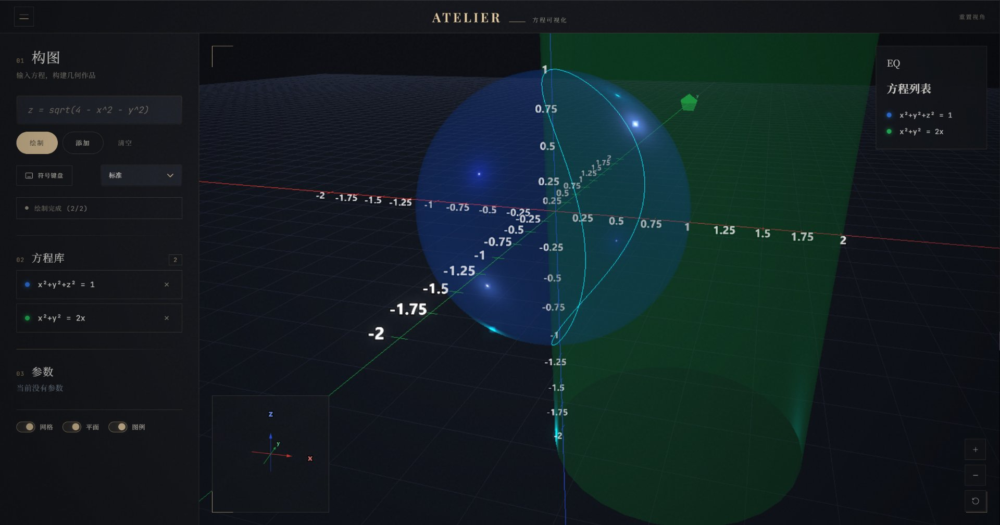

# 方程可视化 · 3D 计算器

一个基于 Web 的交互式 3D 数学方程可视化工具，支持实时渲染复杂数学曲面与曲线，并叠加显示多方程交线。


## 🖼️ 预览

<p align="center">
  <a href="screenshots/demo-sphere-cylinder.jpg">
    
  </a>
</p>

<p align="center">
  <em>单位球 <code>x² + y² + z² = 1</code>（蓝）与参数圆柱 <code>x² + y² = 2a</code>（绿）同屏渲染，<code>a = 1</code>；青色曲线为两曲面自动求出的相交线。<br>拨动右下角的 <code>a</code> 滑块时，圆柱半径会按 <code>√(2a)</code> 实时变化。</em>
</p>

## ✨ 主要特性

- 🌌 **深色科幻风界面**：黑紫渐变主题 + UnrealBloomPass 辉光后处理
- 🧮 **数学公式美化**：`/api/label` 把 `x^2+y^2-z` 美化成 `x² + y² − z`（基于 SymPy）
- ⌨️ **数学键盘**：一键输入 π、e、√、x²、y²、z²、∫、∑ 等符号
- 🎨 **可解析几何优先**：球体 / 圆柱 / 平面 / 椭球用解析网格，其它走 Marching Cubes
- 📈 **动态坐标轴**：自适应刻度、亮度、字号，缩放时自动调整密度
- 🔗 **多方程交线**：自动计算任意两曲面相交的多段折线（Taubin 平滑）
- 🎛️ **画质切换**：质量 1（实时） / 质量 2 / 质量 3（高清重绘）
- 🗂️ **图例管理**：每个方程独立配色，单独显示/隐藏
- 📐 **网格 & 平面切换**：按需开关 3D 网格与坐标平面

## 🚀 快速开始

### 环境要求
- Python 3.8+
- 现代浏览器（支持 WebGL）

### 安装与启动

```bash
# 克隆
git clone https://github.com/Kaltsit-300/EMath3DVisualizer-Web.git
cd EMath3DVisualizer-Web

# 安装依赖
pip install -r requirements_api.txt

# 启动（自动打开浏览器）
python api_server.py
# 或者 Windows 用户直接双击 launch_webapp.bat
```

启动后访问 `http://127.0.0.1:8006`（端口被占用会自动顺延）。

## 📖 使用示例

| 表达式 | 渲染效果 |
| --- | --- |
| `x^2 + y^2 + z^2 = 25` | 半径 5 的球体 |
| `x^2 + y^2 = 4` | 圆柱面 |
| `z = x^2 + y^2` | 抛物面 |
| `x^2/4 + y^2/9 + z^2/16 = 1` | 椭球 |
| `z = sin(x) * cos(y)` | 鞍状曲面 |

多个方程同时输入会自动尝试求交线（折线）。

## 🧩 技术栈

**前端**
- Three.js（WebGL 渲染、UnrealBloomPass 后处理）
- 原生 JS + CSS Grid（无框架依赖）
- Canvas Sprite 标签（坐标轴数字 + 公式标签）

**后端**
- FastAPI（HTTP 服务）
- SymPy（方程解析 + 公式美化）
- NumPy / Scikit-image（Marching Cubes 等值面提取）

## 📁 项目结构

```
EMath3DVisualizer-Web/
├── api_server.py            # FastAPI 服务器（/api/parse, /api/mesh, /api/label ...）
├── mesh_service.py          # 网格生成与交线求解主流程
├── requirements_api.txt     # Python 依赖
├── launch_webapp.bat        # Windows 一键启动脚本
├── services/
│   ├── formula_formatter.py # SymPy → Unicode 美化
│   ├── color_utils.py       # HSV 区分度配色
│   ├── equation_parser.py   # 方程解析
│   ├── mesh_generator.py    # 解析几何 + Marching Cubes
│   └── cache.py             # LRU 缓存装饰器
├── webapp_index.html        # 主页面
├── webapp_app.js            # 前端核心（含深色场景 / 辉光 / 坐标轴）
├── webapp_styles.css        # 深色主题样式
└── README.md
```

## ⚙️ API 端点

| 方法 | 路径 | 说明 |
| --- | --- | --- |
| GET  | `/health`                 | 健康检查 |
| GET  | `/`                       | 主页 HTML |
| POST | `/api/parse`              | 解析方程参数 |
| POST | `/api/mesh`               | 生成网格（顶点 + 面） |
| POST | `/api/intersections`      | 求两曲面交线 |
| POST | `/api/label`              | 把表达式转成美化标签 |
| POST | `/api/rich_label`         | 富文本标签 |
| POST | `/api/color`              | 自动配色 |
| POST | `/api/format`             | 表达式格式化 |

## 🎨 主题设计

- 背景：`#0b0d12`（深空黑）
- 主色：`#7c3aed`（霓虹紫）/ `#06b6d4`（青）
- 强调色：`#f59e0b`（琥珀）
- 字体：UI 用系统无衬线；公式用 STIX / KaTeX 风格 Unicode 字符

## 📝 更新日志

### 2026-07-23
- 重写前端为深色科幻风（黑紫渐变 + UnrealBloomPass 辉光）
- 新增 `/api/label` 公式美化（SymPy → Unicode）
- 新增数学键盘、数学符号快捷输入
- 坐标轴自适应刻度 + 字号 + 亮度
- 网格生成器解析几何优先（球/圆柱/平面/椭球识别）
- 折叠按钮统一支持桌面/移动端
- 坐标轴数字标签默认关闭 bloom、加粗描边

## 🤝 贡献

欢迎提交 Issue 和 Pull Request！

## 📄 许可证

MIT License.